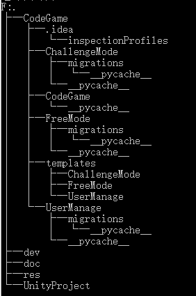

# 计蒜客软件工程实训项目——在线编程游戏

## 小组名：卓越创客

[TOC]

### 0 项目背景

> 本项目为提供给7-14岁青少年儿童娱乐学习使用的在线编程游戏，旨在通过游戏的方式、采用可视化的形式让青少年儿童轻松愉快地掌握顺序、分支、条件等基本的程序设计流程，启蒙青少年儿童的编程思想。

### 1 项目架构

| 工具类型   |工具名称   |
| :-------- | :-------|
| 前端核心  | Vue.js |
| UI核心     |   Element |
| 后台核心      |  Python3 + Django |
| 第三方库 | Google Blockly,Code Mirror |
| 包管理工具 | pip,npm |
| 代码风格检查工具 | Eslint,Pylint |
| 文档生成工具 | Doxygen |

### 2 开发约定

1. doc目录下的文件一律为**MarkDown**格式文档，命名一律采用**<用途>Doc.md**的形式，命名结构为英文大驼峰格式。

### 3 目录结构

#### 3.1 根目录结构

| 目录名   |工具名称   |
| :-------- | :-------|
| **dev** | 存放项目依赖的配置文件。 |
| **doc** | 存放在项目需要使用到的文档文件，用于构建项目的wiki。 |
| **res** | 资源代码，用于存放各种资源文件（图片等）。 |
| **CodeGame** | 项目核心代码，内部为Django项目目录结构。 |
| **UnityProject** | Unity项目代码，用于实现游戏场景的渲染。 |

**项目目录结构图**：

#### 3.2 项目目录结构

| 目录名   |工具名称   |
| :-------- | :-------|
| **CodeGame** | 项目后台整体配置文件目录。 |
| **UserManage** | 项目后台用户管理模块配置文件目录。 |
| **ChallengeMode** | 项目后台挑战模式配置文件目录。 |
| **FreeMode** | 项目后台自由模式配置文件目录。 |
| **frontend** | 项目前端代码目录。 |

### 4 部署方案

#### 4.1 前端部署

1. 将根目录中的**package.json**文件放到**CodeGame/frontend**目录下。
1. 在**CodeGame/frontend**目录下使用`cnpm install`安装JS依赖包。额外需要安装的JS包包括：
    1. **vue-router**
    1. **element-ui**
    1. **axios**
1. 在**CodeGame/frontend**目录下添加**build**目录用于存放若干build配置文件。
1. 使用`npm run build`生成发布目录dist。
1. 使用`npm run dev`运行Vue服务器，进入开发者模式。

#### 4.2 后端部署

1. 使用`pip install django`或`conda install django`安装Django。
1. 使用`pip install django-cors-headers`安装django-cors-headers包实现跨域访问。
1. 使用`mysql -uroot -p<密码> jisuanke < jisuanke.sql`运行项目sql文件创建数据库与数据库对象。
1. 在**/HFUT_Group3/CodeGame/CodeGame/settings.py**文件内修改以下内容：

    ```python
    DATABASES = {
        'default': {
            'ENGINE': 'django.db.backends.mysql',
            'NAME': 'jisuanke',
            'USER': 'root',
            'PASSWORD': '<你的密码>',
            'HOST': 'localhost',
            'PORT': '3306',
        }
    }
    ```

1. 在**/HFUT_Group3/CodeGame/CodeGame/__init__.py**文件内添加以下内容：

    ```python
    import pymysql
    pymysql.install_as_MySQLdb()
    ```

1. 使用`python manage.py inspectdb > <APP名称>/models.py`将数据库导入models文件。
1. 使用`python manage.py runserver`运行项目。
