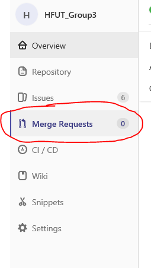
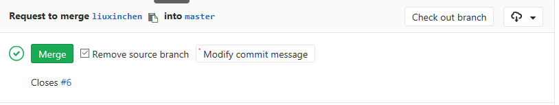

# GitLab使用手册

1. 查看并认领自己的issue

1. 在评论区**评论自己预计完成时间**  比如：`\estimate 1h`，最后点击comment提交评论。

1. 在开发前，在自己的项目目录下（此时应该处于主分支）使用 `git pull` 来更新本地主分支。

1. `git checkout -b  自己的开发分支名` 创建自己的分支

1. **在自己的分支上进行项目开发**

1. 开发完成后，`git add .` （添加全部）

1. `git commit -m  "英文陈述句，描述你做了什么. Ref #xxx"`

1. `git push origin 本地分支名:远端分支名`

1. 再在gitlab上面评论用时 `/spend 时间`

1. 在gitlab对应的分支上创建合并请求。创建合并请求的按钮如下所示（不要找错了。。）：  **点击蓝色按钮 Create merge request！！！**

1. MR描述内容：

    ```text
    This MR creates areadme.md` to this project, with an overview of this app.

    Closes #xxx and (+对应issue的网址)

    Preview: + 图片

    cc/ @组员审查你的合并
    ```

1. 选择对应的milestone

1. 确定source 和 target， **注意`target`一定要要是`master`,`source`一定是你自己的分支**

1. **勾选 remove source 自己分支的选项**

1. 提交合并请求。

1. 点击Merge按钮。

1. 查看本地分支，切换到主分支 `git checkout master` 

1. 先 `git pull` 统一主分支。

1. 再`git branch -d 自己的分支名` 删除自己的分支。
